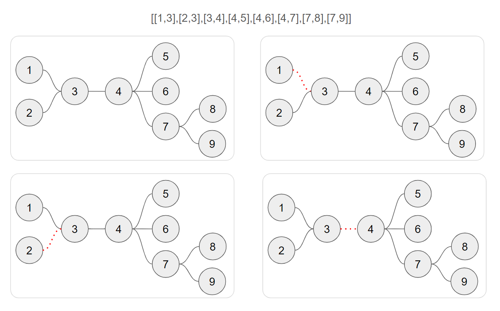

# 11 그래프
## 송전탑 둘로 나누기
* 풀이 방법
- 
* 코드
``` python
import copy
from collections import defaultdict


def dfs(graph, start_v):
    visited = []

    def dfs_inner(cur_v):
        visited.append(cur_v)
        for node in graph[cur_v]:
            if node not in visited:
                dfs_inner(node)

    dfs_inner(start_v)
    return len(visited)

def generate_graph(nodes):
    graph = defaultdict(list)
    for u, v in nodes:
        graph[u].append(v)
        graph[v].append(u)
    return graph

def solution(n, wires_):
    print('wires : ', wires_)
    diff = float('inf')
    for remove_idx in range(0, len(wires_)):
        print(f'제거 : {wires_[remove_idx]}')
        wires = copy.deepcopy(wires_)
        wires.remove(wires_[remove_idx])
        connected_graph = generate_graph(wires)
        left_nodes = dfs(connected_graph, 1)
        right_nodes = n-left_nodes
        diff = min(diff, abs(left_nodes-right_nodes))
        print(f'graph : {list(connected_graph.items())}')
        print(f'노드 개수 : {left_nodes}, diff : {diff}\n')
    print('-' * 20)
    return diff
```
* 결과
``` 
wires :  [[1, 3], [2, 3], [3, 4], [4, 5], [4, 6], [4, 7], [7, 8], [7, 9]]
제거 : [1, 3]
graph : [(2, [3]), (3, [2, 4]), (4, [3, 5, 6, 7]), (5, [4]), (6, [4]), (7, [4, 8, 9]), (8, [7]), (9, [7]), (1, [])]
노드 개수 : 1, diff : 7

제거 : [2, 3]
graph : [(1, [3]), (3, [1, 4]), (4, [3, 5, 6, 7]), (5, [4]), (6, [4]), (7, [4, 8, 9]), (8, [7]), (9, [7])]
노드 개수 : 8, diff : 7

제거 : [3, 4]
graph : [(1, [3]), (3, [1, 2]), (2, [3]), (4, [5, 6, 7]), (5, [4]), (6, [4]), (7, [4, 8, 9]), (8, [7]), (9, [7])]
노드 개수 : 3, diff : 3

제거 : [4, 5]
graph : [(1, [3]), (3, [1, 2, 4]), (2, [3]), (4, [3, 6, 7]), (6, [4]), (7, [4, 8, 9]), (8, [7]), (9, [7])]
노드 개수 : 8, diff : 3

제거 : [4, 6]
graph : [(1, [3]), (3, [1, 2, 4]), (2, [3]), (4, [3, 5, 7]), (5, [4]), (7, [4, 8, 9]), (8, [7]), (9, [7])]
노드 개수 : 8, diff : 3

제거 : [4, 7]
graph : [(1, [3]), (3, [1, 2, 4]), (2, [3]), (4, [3, 5, 6]), (5, [4]), (6, [4]), (7, [8, 9]), (8, [7]), (9, [7])]
노드 개수 : 6, diff : 3

제거 : [7, 8]
graph : [(1, [3]), (3, [1, 2, 4]), (2, [3]), (4, [3, 5, 6, 7]), (5, [4]), (6, [4]), (7, [4, 9]), (9, [7])]
노드 개수 : 8, diff : 3

제거 : [7, 9]
graph : [(1, [3]), (3, [1, 2, 4]), (2, [3]), (4, [3, 5, 6, 7]), (5, [4]), (6, [4]), (7, [4, 8]), (8, [7])]
노드 개수 : 8, diff : 3
```